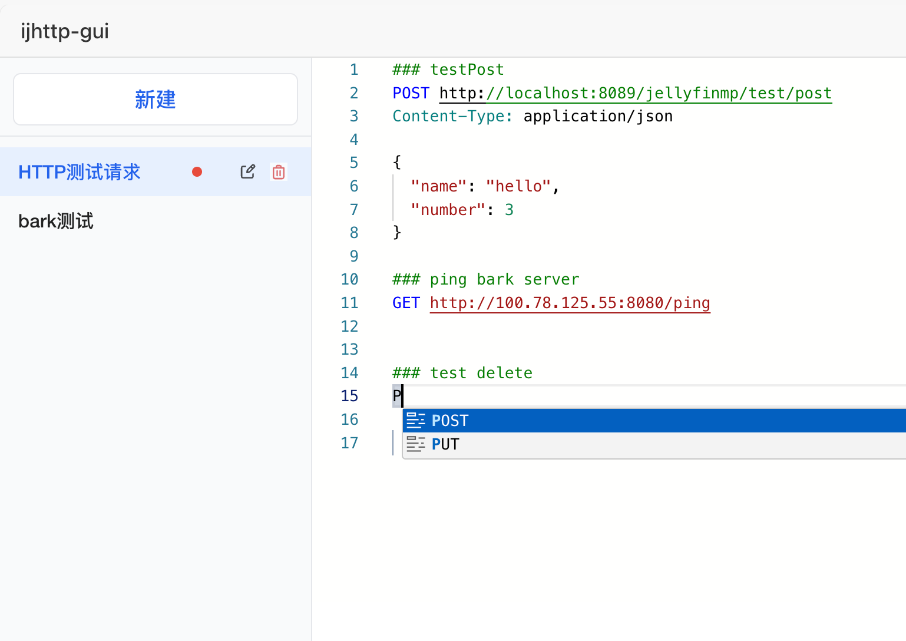
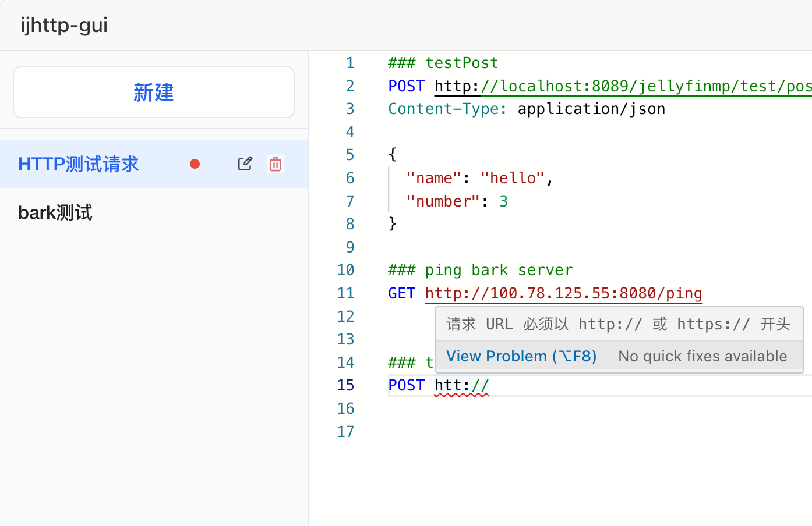
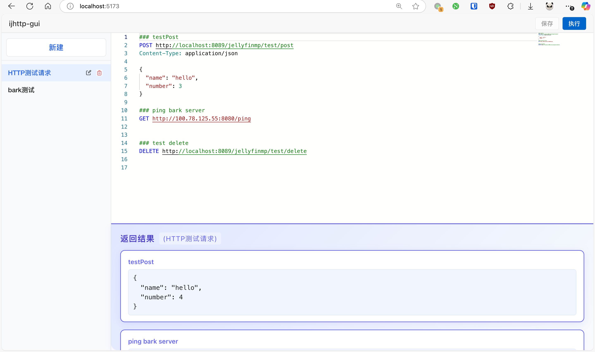

# ijhttp-gui

一个给ijhttp做的web interface. 当前处于非常早期的开发阶段. 可以称之为一个Demo.

    ijhttp是什么: JetBrains家的http-client插件的CLI工具版.

我很喜欢用JetBrains家的http-client, 但是有两点限制: 

1. Community版不可用(多个IDE推出non-commercial use使得这个情况有所好转)
2. 必须要搭配IDE使用. 之前我的用法是DataGrip同时用作数据库管理和HTTP请求管理. 但是近来一直在用vscode开发和使用mongodb compass, DataGrip也很少打开了.

因此做了这个web端的ijhttp请求工具, 力求做到原汁原味的http-client体验.

代码提示

语法校验

执行结果